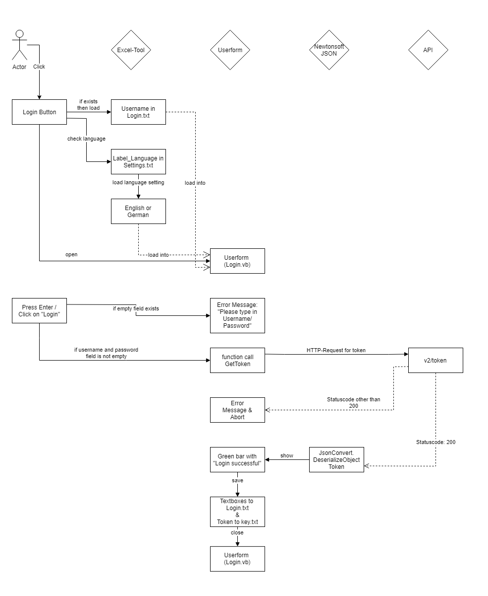

## Login

Login.vb is the frame for the login process.

After the user presses the login button on the ribbon, the Exce-AddIn loads the username in the textfile Login.txt, if it exists, and it loads the language setting in the textfile Settings.txt, if it exists.

After performing these processes, the Excel-Tool opens the userform, in which the user can enter his credentials and login by pressing the login button on the userform.

The user presses the login button on the userform. The userform then checks if both the username field or the password field are not empty, otherwise it will prompt an error message and quit.

When both fields are filled the userform generates an url and gets the response with HTTPRequest from the aedifion API.

The response contains two elements, which will be saved in an array called login(1). The element login(0) contains the content while the element login(1) contains the status code.

If the status code is other than '200', which is the status code for successful response, the userform will prompt an error message and quit.

If the status code is 200, the Newtonsoft JSON Plugin will deserialize the json-file and read the content, in this case, the token.

The textboxes without the password textbox will then be exported to the file login.txt. The next time, the login userform is opened, the exported username textbox will be filled.

The token-string will be exported to the file key.txt. This file will be used by all other processes when communicating with the API.

A green bar with the string 'Login Successful' will indicate a successful login to the user.

After performing the tasks, the userform will close.

